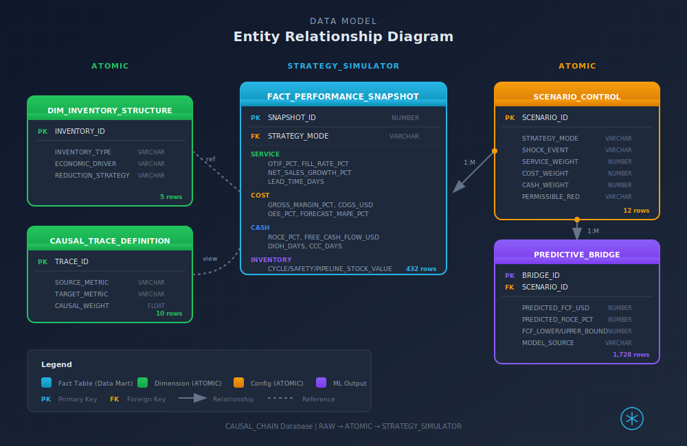

# Project Causal Chain: Architecture Diagram Specification
## Technical Implementation Guide

---

## Full Architecture Diagram


---

## Data Model



---

## Pattern: Left-to-Right Data Journey

This architecture follows the **Left-to-Right** pattern, emphasizing the data journey from source systems through processing to business outcomes.

---

## Level 1: Executive View (5-7 boxes)

```
┌─────────────────────────────────────────────────────────────────────────────────┐
│                                                                                 │
│   ┌───────────┐     ┌─────────────────┐     ┌───────────────┐     ┌──────────┐│
│   │  SOURCE   │────►│    SNOWFLAKE    │────►│   CORTEX AI   │────►│ INSIGHTS ││
│   │  SYSTEMS  │     │   DATA LAYER    │     │   SERVICES    │     │   APP    ││
│   └───────────┘     └─────────────────┘     └───────────────┘     └──────────┘│
│                                                                                 │
│   ERP, TMS,         Curated Tables,         Analyst, Search,      Strategy     │
│   Demand Plans,     ML Predictions,         Complete               Simulator    │
│   QBR Documents     Semantic Model                                              │
│                                                                                 │
└─────────────────────────────────────────────────────────────────────────────────┘
```

**Key Message for Executives:** All supply chain data flows into Snowflake, AI extracts insights, and the Strategy Simulator enables scenario planning in real-time.

---

## Level 2: Architect View (Service Layers)

```
┌──────────────────────────────────────────────────────────────────────────────────┐
│                                                                                  │
│  DATA SOURCES                    SNOWFLAKE PLATFORM                   CONSUMERS  │
│  ────────────                    ──────────────────                   ─────────  │
│                                                                                  │
│  ┌──────────┐                    ┌──────────────────────────────────┐           │
│  │   ERP    │                    │         RAW LAYER                │           │
│  │ (SAP/    │──── Daily ────────►│  Stages: ERP_STAGE, TMS_STAGE    │           │
│  │ Oracle)  │     Batch          │  Format: CSV, Parquet            │           │
│  └──────────┘                    └──────────────┬───────────────────┘           │
│                                                 │                                │
│  ┌──────────┐                                   │ Streams + Tasks               │
│  │   TMS    │                                   │ (CDC / Scheduled)             │
│  │ (Freight │──── Hourly ───────►               ▼                               │
│  │  Data)   │                    ┌──────────────────────────────────┐           │
│  └──────────┘                    │       ANALYTICS LAYER            │           │
│                                  │                                  │           │
│  ┌──────────┐                    │  ┌────────────────────────────┐  │           │
│  │ Demand   │                    │  │ FACT_PERFORMANCE_SNAPSHOT  │  │           │
│  │ Planning │──── Daily ────────►│  │ (432 rows, 36 months)      │  │           │
│  │ (S&OP)   │                    │  │ - Service: OTIF, Fill Rate │  │           │
│  └──────────┘                    │  │ - Cost: Margin, COGS, OEE  │  │           │
│                                  │  │ - Cash: ROCE, FCF, CCC     │  │           │
│  ┌──────────┐                    │  └────────────────────────────┘  │           │
│  │   QBR    │                    │                                  │           │
│  │ Documents│──── Ad-hoc ───────►│  ┌────────────────────────────┐  │           │
│  │  (PDFs)  │                    │  │ DIM_INVENTORY_STRUCTURE    │  │           │
│  └──────────┘                    │  │ (Cycle, Safety, Pipeline,  │  │           │
│                                  │  │  Anticipation, Strategic)  │  │           │
│                                  │  └────────────────────────────┘  │           │
│                                  │                                  │           │
│                                  │  ┌────────────────────────────┐  │           │
│                                  │  │ SCENARIO_CONTROL           │  │           │
│                                  │  │ (Growth, Margin, Cash +    │  │           │
│                                  │  │  Shock Events)             │  │           │
│                                  │  └────────────────────────────┘  │           │
│                                  └──────────────┬───────────────────┘           │
│                                                 │                                │
│                                                 │ Join / Aggregate               │
│                                                 ▼                                │
│                                  ┌──────────────────────────────────┐           │
│                                  │      CONSUMPTION LAYER           │           │
│                                  │                                  │           │
│                                  │  ┌────────────────────────────┐  │           │
│                                  │  │ PREDICTIVE_BRIDGE          │  │   ┌──────┐│
│                                  │  │ (Pre-computed ML outputs)  │──┼──►│ CFO  ││
│                                  │  │ - Predicted FCF, ROCE      │  │   └──────┘│
│                                  │  │ - Confidence intervals     │  │           │
│                                  │  │ - Lead time impacts        │  │   ┌──────┐│
│                                  │  └────────────────────────────┘  │   │  VP  ││
│                                  │                                  │   │Supply││
│                                  │  ┌────────────────────────────┐  │   │Chain ││
│                                  │  │ CAUSAL_TRACE_DEFINITIONS   │──┼──►└──────┘│
│                                  │  │ (Source → Target → Impact) │  │           │
│                                  │  └────────────────────────────┘  │   ┌──────┐│
│                                  └──────────────┬───────────────────┘   │ Data ││
│                                                 │                       │Analyst│
│                                                 ▼                       └──────┘│
│                                  ┌──────────────────────────────────┐           │
│                                  │      INTELLIGENCE LAYER          │           │
│                                  │                                  │           │
│                                  │  ┌────────────────────────────┐  │           │
│                                  │  │ CORTEX ANALYST             │  │           │
│                                  │  │ Semantic Model:            │  │           │
│                                  │  │  - 4 tables                │  │           │
│                                  │  │  - 25+ dimensions/metrics  │  │           │
│                                  │  │  - 6 verified queries      │  │           │
│                                  │  └────────────────────────────┘  │           │
│                                  │                                  │           │
│                                  │  ┌────────────────────────────┐  │           │
│                                  │  │ CORTEX SEARCH              │  │           │
│                                  │  │ Service: SUPPLY_CHAIN_     │  │           │
│                                  │  │   CONTEXT_SEARCH           │  │           │
│                                  │  │ Index: QBR_DOCUMENTS       │  │           │
│                                  │  └────────────────────────────┘  │           │
│                                  │                                  │           │
│                                  │  ┌────────────────────────────┐  │           │
│                                  │  │ CORTEX COMPLETE            │  │           │
│                                  │  │ Model: mistral-large2      │  │           │
│                                  │  │ Use: Trade-off explanations│  │           │
│                                  │  └────────────────────────────┘  │           │
│                                  └──────────────┬───────────────────┘           │
│                                                 │                                │
│                                                 │ API Calls                      │
│                                                 ▼                                │
│                                  ┌──────────────────────────────────┐           │
│                                  │      APPS LAYER                  │           │
│                                  │                                  │           │
│                                  │  ┌────────────────────────────┐  │           │
│                                  │  │ STREAMLIT: STRATEGY_       │  │           │
│                                  │  │   SIMULATOR                │  │           │
│                                  │  │                            │  │           │
│                                  │  │ Components:                │  │           │
│                                  │  │  - Strategy Selector       │  │           │
│                                  │  │  - Trade-Off Triangle      │  │           │
│                                  │  │  - ROCE Sensitivity        │  │           │
│                                  │  │  - Inventory Decomposition │  │           │
│                                  │  │  - Causal Sankey           │  │           │
│                                  │  │  - Financial Bridge        │  │           │
│                                  │  │  - AI Assistant            │  │           │
│                                  │  └────────────────────────────┘  │           │
│                                  └──────────────────────────────────┘           │
│                                                                                  │
└──────────────────────────────────────────────────────────────────────────────────┘
```

---

## Level 3: Engineer View (Implementation Details)

### Data Flow Specifications

| Connection | Source | Target | Frequency | Volume | Format |
|------------|--------|--------|-----------|--------|--------|
| ERP → RAW | ERP System | ERP_STAGE | Daily | ~10K rows/day | CSV |
| TMS → RAW | TMS System | TMS_STAGE | Hourly | ~5K rows/hour | Parquet |
| S&OP → RAW | Demand Planning | DEMAND_STAGE | Daily | ~1K rows/day | CSV |
| QBR → RAW | SharePoint/Local | QBR_STAGE | Ad-hoc | ~3 docs/quarter | PDF |
| RAW → ANALYTICS | Stages | Tables | Near-real-time | Via Streams | Transformed |
| ANALYTICS → CONSUMPTION | Tables | Views/Tables | Continuous | Aggregated | Joined |

### Schema Layout

```
CAUSAL_CHAIN (Database)
├── RAW (Schema)
│   ├── ERP_STAGE
│   ├── TMS_STAGE
│   ├── DEMAND_STAGE
│   └── QBR_STAGE
│
├── ANALYTICS (Schema)
│   ├── FACT_PERFORMANCE_SNAPSHOT (Table)
│   ├── DIM_INVENTORY_STRUCTURE (Table)
│   ├── SCENARIO_CONTROL (Table)
│   └── ML_PREDICTION_REGISTRY (Table)
│
├── CONSUMPTION (Schema)
│   └── PREDICTIVE_BRIDGE (Table)
│
├── INTELLIGENCE (Schema)
│   ├── CAUSAL_TRACE_DEFINITIONS (Table)
│   ├── QBR_DOCUMENTS (Table)
│   └── SUPPLY_CHAIN_CONTEXT_SEARCH (Cortex Search Service)
│
└── APPS (Schema)
    └── STRATEGY_SIMULATOR (Streamlit App)
```

### Snowflake Objects Deployed

| Object Type | Name | Purpose |
|-------------|------|---------|
| Database | CAUSAL_CHAIN | Solution container |
| Warehouse | CAUSAL_CHAIN_WH (XS) | Query execution |
| Role | CAUSAL_CHAIN_ROLE | Access control |
| Stage | @RAW.DATA_STAGE | File ingestion |
| Stage | @INTELLIGENCE.SEMANTIC_STAGE | Semantic model YAML |
| Table | ANALYTICS.FACT_PERFORMANCE_SNAPSHOT | 36-month performance data |
| Table | ANALYTICS.DIM_INVENTORY_STRUCTURE | Inventory type definitions |
| Table | ANALYTICS.SCENARIO_CONTROL | Strategy mode parameters |
| Table | CONSUMPTION.PREDICTIVE_BRIDGE | ML predictions |
| Table | INTELLIGENCE.CAUSAL_TRACE_DEFINITIONS | Causal relationships |
| Table | INTELLIGENCE.QBR_DOCUMENTS | Document content for RAG |
| Cortex Search | SUPPLY_CHAIN_CONTEXT_SEARCH | QBR document search |
| Streamlit App | STRATEGY_SIMULATOR | Interactive dashboard |

### Security Model

```
┌─────────────────────────────────────────────────────┐
│                 ACCOUNTADMIN                         │
│                     │                               │
│                     ▼                               │
│           CAUSAL_CHAIN_ROLE                         │
│           ┌─────────┴─────────┐                     │
│           │                   │                     │
│           ▼                   ▼                     │
│     USAGE on           USAGE on                     │
│     CAUSAL_CHAIN      CAUSAL_CHAIN_WH              │
│           │                                         │
│           ▼                                         │
│     SELECT/INSERT on                                │
│     all schemas                                     │
│           │                                         │
│           ▼                                         │
│     USAGE on Cortex                                 │
│     (Analyst, Search, Complete)                     │
└─────────────────────────────────────────────────────┘
```

---

## Integration Points

### Cortex Analyst Configuration

```yaml
Semantic Model: causal_chain_model.yaml
Location: @INTELLIGENCE.SEMANTIC_STAGE/causal_chain_model.yaml
Tables: 4 (performance, inventory_structure, scenarios, predictions)
Dimensions: 15
Facts: 25
Metrics: 9
Verified Queries: 6
```

### Cortex Search Configuration

```yaml
Service: SUPPLY_CHAIN_CONTEXT_SEARCH
Target Table: INTELLIGENCE.QBR_DOCUMENTS
Search Column: CONTENT_TEXT
Embedding Model: Default (768-dim)
Refresh: On INSERT
```

### Streamlit App Configuration

```yaml
App Name: STRATEGY_SIMULATOR
Database: CAUSAL_CHAIN
Schema: APPS
Warehouse: CAUSAL_CHAIN_WH
Dependencies:
  - plotly
  - pandas
Main File: streamlit_app.py
```

---

## Quality Checkpoint

- [x] Left-to-right flow from sources to outcomes
- [x] All components from solution walkthrough represented
- [x] Arrows labeled with frequency (daily, hourly, real-time)
- [x] Snowflake capabilities named (Cortex Analyst, Search, Complete)
- [x] Three detail levels (Executive, Architect, Engineer)
- [x] Schema layout documented
- [x] Security model defined

---

*Document Version: 1.0 | Created: 2026-01-25 | Project Causal Chain*
